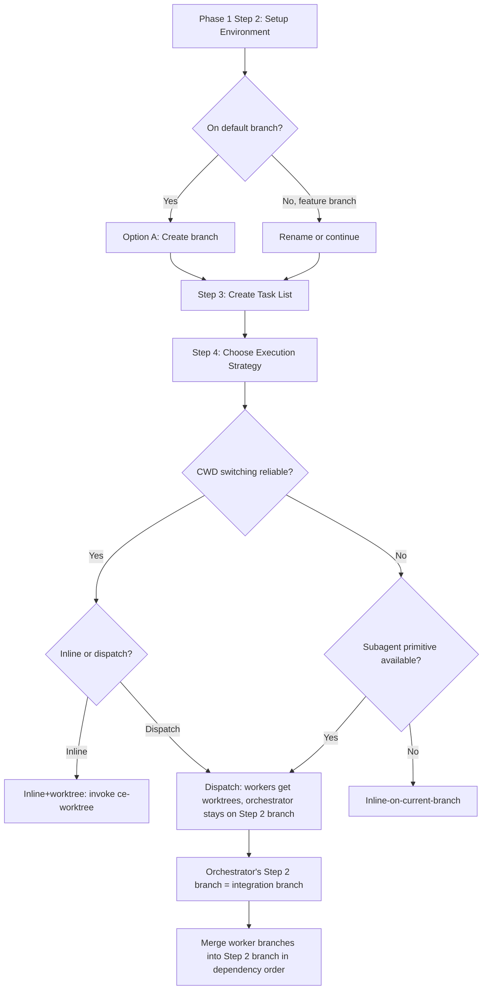

# fix: Restructure worktree isolation — orchestrator stays put

## Summary

Move the worktree creation decision from ce-work's environment setup (Step 2) to the execution-strategy step (Step 4), add CWD-switching capability detection so inline+worktree is only offered where it works, and keep the orchestrator in its original checkout during subagent dispatch.

## Problem Frame

ce-worktree Step 2 instructs the orchestrator to `cd` into the worktree, but in harnesses where file operations are managed separately from shell `cd`, the worktree sits unused while work happens on a branch in the main checkout. The worktree decision also fires in ce-work Phase 1 Step 2 (environment setup), before the execution strategy is chosen in Step 4 — so in dispatch mode, the Step 2 worktree is created but never used because subagents get their own per-agent worktrees via the harness primitive.

## Requirements

**Workspace isolation**

- R1. The worktree decision is made in the execution-strategy step (Step 4), not the environment-setup step (Step 2).
- R2. Step 2 handles branch creation for the current-checkout path only and does not offer a worktree option.
- R3. In inline mode, the orchestrator may enter a worktree only when the harness supports reliable CWD switching; otherwise the inline-on-current-branch path is offered.
- R4. In dispatch mode, the orchestrator does not enter a worktree. Worker subagents receive their own worktree isolation.
- R5. The orchestrator's Step 2 branch serves as the integration branch for worker merges in dispatch mode.

**Capability detection**

- R6. The skill detects whether the harness supports reliable CWD switching — via a native worktree tool or a harness-level directory primitive that propagates to file operations — before offering the inline+worktree path. If reliable detection cannot be implemented for a given harness, that harness falls back to the dispatch or inline paths.
- R7. When CWD switching is unsupported, the dispatch-worker-into-worktree path is offered as the isolation alternative, subject to subagent primitive availability.

## Key Technical Decisions

- **KTD1: CWD-switching detection via per-platform prose enumeration.** The repo has no prior art for detecting reliable CWD switching. The approach mirrors the established blocking-question tool pattern: enumerate known harnesses and their CWD behavior in prose, with the agent checking its current harness against the list. Unknown harnesses default to unreliable (offer fallback paths). This avoids inventing a runtime probe — the detection is instruct-the-agent-to-check style, consistent with how native worktree tool detection already works in ce-worktree Step 1. Rationale: the blocking-question tool pattern is used in 8+ skills and is the proven approach for per-harness capability detection in this plugin.

- **KTD2: Step 4 decision matrix has three paths, not a nested capability tree.** The restructured Step 4 offers: (a) inline+worktree — only when CWD switching is reliable, (b) inline-on-current-branch — the fallback when worktree isolation is unavailable, (c) dispatch-worker-into-worktree — subagents get worktrees, orchestrator stays on the Step 2 branch. The matrix is flat, not nested under capability detection, because the three paths are mutually exclusive at decision time. Rationale: a flat matrix is easier for the agent to render across harnesses than a nested tree.

- **KTD3: ce-worktree's internal steps are unchanged.** ce-worktree Step 0 (detect existing), Step 1 (native tool), Step 2 (git fallback), and Merge-back are all unchanged. Only the Integration section updates to reflect that ce-work now invokes at Step 4, not Step 2. Rationale: the requirements doc Scope Boundaries explicitly excludes ce-worktree's lifecycle and merge-back behavior.

- **KTD4: ce-work-beta mirrors the change in parallel.** `tests/pipeline-review-contract.test.ts` enforces that ce-work-beta mirrors ce-work's Step 2 and Step 4 structure. The plan updates both skills in the same PR to avoid contract test failures. Rationale: the mirroring tests will fail if only ce-work is updated.

- **KTD5: Correct ce-code-review documentation drift.** ce-worktree's description and Integration section claim ce-code-review offers it as an option, but ce-code-review's SKILL.md has no worktree reference. The plan corrects this drift by removing the ce-code-review claim from ce-worktree's description and Integration section. Rationale: stale integration claims mislead implementers about which skills invoke ce-worktree.

---

## High-Level Technical Design

The decision flow shows how capability detection (R6) gates the inline+worktree path, and how the Step 2 branch becomes the integration branch in dispatch mode (R5).

---

## Scope Boundaries

**Outside this scope**

- Merge-back branch-switching behavior. The main checkout still switches to the base branch during merge-back, unchanged from today.
- Harness-native worktree lifecycle (ce-worktree Step 1). The harness owns creation, navigation, and cleanup; this change does not alter that path.
- Pre-existing isolation detection (ce-worktree Step 0). Work-in-place behavior when already isolated is unchanged.
- ce-worktree's internal Step 0/Step 1/Step 2 logic and Merge-back flow. Only the Integration section and description are updated.

**Deferred to follow-up work**

- Per-harness CWD-switching capability matrix. The plan specifies the detection approach (prose enumeration) but the exact per-harness mapping (which of Claude Code, Codex, Devin CLI, Cursor, OpenCode support reliable CWD switching) is deferred to implementation as execution-time discovery.
- ce-worktree Step 2's `cd` instruction behavior on unsupported harnesses. The requirements doc acknowledges this as a capability reduction (the worktree option is removed rather than made functional). A future effort could explore absolute-path file operations as an alternative to CWD switching.

---

## Implementation Units

### U1. Restructure ce-work Step 2 — remove worktree option, branch-only

- **Goal:** Remove the worktree option (Option B) from ce-work Phase 1 Step 2 so it handles branch creation only.
- **Requirements:** R1, R2
- **Dependencies:** none
- **Files:**
  - `skills/ce-work/SKILL.md` (modify — remove Option B and its Recommendation block, lines 100-115)
- **Approach:** Delete the "Option B: Use a worktree" block and the "Recommendation: Use worktree if..." block from Step 2. Step 2 retains: branch check, "already on feature branch" rename flow, Option A (create new branch), Option C (continue on default with explicit confirmation). The three-option menu becomes two options (A and C) when on the default branch. Add a one-line note that worktree isolation, if needed, is decided in Step 4 alongside the execution strategy.
- **Patterns to follow:** The existing Option A and Option C prose style. The "already on feature branch" flow at lines 77-90 is the model for keeping Step 2 focused on branch state.
- **Test scenarios:**
  - Step 2 no longer contains `skill: ce-worktree` or `Option B: Use a worktree`
  - Step 2 still contains Option A (create new branch) and Option C (continue on default)
  - Step 2 still contains the branch-meaningfulness rename flow
  - Step 2 mentions that worktree isolation is decided in Step 4
- **Verification:** Step 2 reads as a branch-creation-only step with no worktree invocation. The two remaining options (A and C) are self-contained.

### U2. Restructure ce-work Step 4 — capability detection, decision matrix, orchestrator-stays-put

- **Goal:** Add CWD-switching capability detection and a new three-path decision matrix to ce-work Phase 1 Step 4. Establish the orchestrator-stays-put rule for dispatch mode and the Step 2 branch as integration branch.
- **Requirements:** R3, R4, R5, R6, R7
- **Dependencies:** U1
- **Files:**
  - `skills/ce-work/SKILL.md` (modify — restructure Step 4, lines 130-191)
- **Approach:**
  - Add a capability-detection subsection at the top of Step 4 that checks for reliable CWD switching. Follow the per-platform prose enumeration pattern from the blocking-question tool convention: name the known harnesses and their CWD behavior, with unknown harnesses defaulting to unreliable. Two signals indicate reliable CWD switching: (a) a native worktree tool exists (ce-worktree Step 1 already detects this), or (b) the harness's file-operation layer follows shell `cd`. When neither signal is present, CWD switching is unreliable.
  - Replace the current 3-row strategy table with a decision matrix that incorporates the capability detection:
    - **Inline+worktree** — chosen when CWD switching is reliable and the work is small (1-2 tasks). Invokes `ce-worktree` to create the worktree and `cd` into it. The orchestrator works inside the worktree for the duration.
    - **Inline-on-current-branch** — chosen when CWD switching is unreliable and no subagent primitive is available, or when the user prefers to work without isolation. The orchestrator works on the Step 2 branch in the current checkout.
    - **Dispatch-worker-into-worktree** — chosen when subagent primitive is available and the work has 3+ tasks. Worker subagents get per-agent worktree isolation (existing harness primitive). The orchestrator stays on the Step 2 branch and serves as the integration point.
  - Add the orchestrator-stays-put rule: in dispatch mode, the orchestrator never enters a worktree. The Step 2 branch is the integration branch — worker branches merge into it in dependency order (existing post-batch flow at lines 173-183 already does this; the change is making the rule explicit).
  - Keep the existing Parallel Safety Check, subagent isolation instructions, shared-directory fallback constraints, and post-batch flows. They already handle the mechanics of worktree-isolated dispatch and shared-directory fallback.
  - Keep the existing serial-subagent path as a sub-option of dispatch (serial vs parallel dispatch is an orthogonal decision based on file overlap, not capability detection).
- **Patterns to follow:** The blocking-question tool detection pattern (`skills/ce-brainstorm/SKILL.md` line 35) for the per-platform enumeration style. The existing subagent isolation section (lines 149-151) for the Claude-Code-specific primitive + fallback pattern. The existing Parallel Safety Check (lines 140-147) for file-overlap detection.
- **Test scenarios:**
  - Step 4 contains a capability-detection subsection that names CWD switching
  - Step 4 contains the three decision paths: inline+worktree, inline-on-current-branch, dispatch-worker-into-worktree
  - Step 4 states that inline+worktree is gated on reliable CWD switching
  - Step 4 states that the orchestrator does not enter a worktree in dispatch mode
  - Step 4 states that the Step 2 branch serves as the integration branch for worker merges
  - Step 4 still contains the Parallel Safety Check and subagent isolation instructions
  - Step 4 still contains the shared-directory fallback constraints
- **Verification:** Step 4 reads as a decision matrix that gates inline+worktree on capability detection, keeps the orchestrator in its original checkout during dispatch, and preserves all existing dispatch mechanics.

### U3. Update ce-worktree Integration section and description

- **Goal:** Update ce-worktree's Integration section to reflect that ce-work now invokes at Step 4, and correct the ce-code-review documentation drift.
- **Requirements:** R1 (traceability — ce-worktree integration references the new invocation point)
- **Dependencies:** U1, U2
- **Files:**
  - `skills/ce-worktree/SKILL.md` (modify — Integration section line 123, description line 3)
- **Approach:**
  - Update the Integration section: change "ce-work and ce-code-review offer this skill as an option" to "ce-work offers this skill as an option at Step 4 (execution strategy)." Remove the ce-code-review claim since ce-code-review's SKILL.md has no worktree reference.
  - Update the description (frontmatter line 3): remove "or `ce-code-review` offers a worktree option" from the `Use when` clause. Keep the rest of the description intact.
  - Update the second Integration paragraph: change "ce-work (Phase 4)" to "ce-work (Phase 4)" — this reference is to the shipping phase, not Step 4, so it stays. But update any wording that implies ce-work created the worktree at Step 2.
- **Patterns to follow:** The existing Integration section's prose style.
- **Test scenarios:**
  - Integration section references Step 4, not Step 2, as the invocation point
  - Integration section does not claim ce-code-review offers ce-worktree
  - Description does not reference ce-code-review
  - Merge-back reference (ce-work Phase 4, lfg after PR step) is preserved
- **Verification:** ce-worktree's Integration section and description accurately reflect which skills invoke it and at which step.

### U4. Update downstream references

- **Goal:** Update reference files that mention Step 2 as the worktree creation point.
- **Requirements:** R1 (traceability — all references to the worktree creation step point to Step 4)
- **Dependencies:** U1, U2
- **Files:**
  - `skills/ce-work/references/shipping-workflow.md` (modify — line 108, "Phase 1 Step 2 created a git-fallback worktree" → reference the new creation point)
  - `skills/ce-work/references/non-code-execution.md` (modify — line 9, "No branch/worktree setup (Phase 1 Step 2)" → "No branch setup (Phase 1 Step 2)")
  - `skills/ce-work-beta/references/non-code-execution.md` (modify — line 9, same update as the ce-work copy)
  - `skills/lfg/SKILL.md` (modify — step 10, verify gating wording does not reference "Step 2" by name; if it does, update to reference the new creation point)
- **Approach:**
  - shipping-workflow.md line 108: change "only when Phase 1 Step 2 created a git-fallback worktree" to "only when a git-fallback worktree was created during execution setup" — the gating condition is about whether a git-fallback worktree exists, not which step created it. This is a wording update, not a logic change.
  - non-code-execution.md line 9: change "No branch/worktree setup (Phase 1 Step 2)" to "No branch setup (Phase 1 Step 2)" since Step 2 no longer handles worktree setup. Worktree isolation is now a Step 4 decision, which the non-code carve-out already skips (it skips all of Step 4's execution-strategy logic).
  - lfg/SKILL.md step 10: the current wording says "only when the run used a git-fallback worktree" without naming the step — verify this is still accurate and does not need updating. If it references "Step 2" anywhere, update to "execution setup" or similar.
- **Patterns to follow:** The existing prose style in each reference file.
- **Test scenarios:**
  - shipping-workflow.md does not reference "Phase 1 Step 2" as the worktree creation point
  - non-code-execution.md does not reference worktree setup at Step 2
  - lfg/SKILL.md step 10 gating condition is accurate (references the worktree's existence, not the step that created it)
- **Verification:** No downstream reference file claims Step 2 is the worktree creation point.

### U5. Mirror changes in ce-work-beta

- **Goal:** Apply the same Step 2 and Step 4 restructuring to ce-work-beta to satisfy the mirroring tests in `tests/pipeline-review-contract.test.ts`.
- **Requirements:** R1, R2, R3, R4, R5, R6, R7 (mirror of ce-work changes)
- **Dependencies:** U1, U2
- **Files:**
  - `skills/ce-work-beta/SKILL.md` (modify — Step 2 Option B removal, Step 4 restructuring)
- **Approach:** Mirror the Step 2 and Step 4 changes from U1 and U2 into ce-work-beta. ce-work-beta has the same Option B at line 151 and the same Step 4 structure at line 181. Apply the same removals and additions. ce-work-beta has additional Codex delegation content in Step 4 — preserve that and integrate the new decision matrix alongside it. The Codex delegation path is a variant of dispatch-worker-into-worktree, so it fits naturally under the new matrix.
- **Patterns to follow:** The exact changes made to ce-work in U1 and U2. The existing ce-work-beta Codex delegation content structure.
- **Test scenarios:**
  - ce-work-beta Step 2 does not contain `skill: ce-worktree` or `Option B: Use a worktree`
  - ce-work-beta Step 4 contains the same three-path decision matrix as ce-work
  - ce-work-beta Step 4 still contains the Codex delegation content
  - `tests/pipeline-review-contract.test.ts` mirroring tests pass
- **Verification:** `bun test tests/pipeline-review-contract.test.ts` passes with both ce-work and ce-work-beta updated.

### U6. Add and update tests

- **Goal:** Add prose-invariant tests for the restructured ce-work Step 2 and Step 4, and update ce-worktree tests if needed.
- **Requirements:** R1-R7 (test coverage for all requirements)
- **Dependencies:** U1, U2, U3, U5
- **Files:**
  - `tests/skills/ce-work.test.ts` (create — new per-skill test file for ce-work prose invariants)
  - `tests/skills/ce-worktree.test.ts` (modify — update if Integration section wording changes affect existing assertions)
- **Approach:**
  - Create `tests/skills/ce-work.test.ts` following the pattern of `tests/skills/ce-worktree.test.ts`. Guard:
    - Step 2 does not contain `skill: ce-worktree` (R2)
    - Step 2 does not contain `Option B` or `Use a worktree` (R2)
    - Step 4 contains a capability-detection subsection mentioning CWD switching (R6)
    - Step 4 contains `inline+worktree` or equivalent inline+worktree path label (R3)
    - Step 4 contains `inline-on-current-branch` or equivalent fallback path label (R3)
    - Step 4 contains `dispatch` path with worktree isolation for workers (R4)
    - Step 4 states the orchestrator does not enter a worktree in dispatch mode (R4)
    - Step 4 references the Step 2 branch as integration branch (R5)
  - Update `tests/skills/ce-worktree.test.ts` if the Integration section wording changes break any existing assertions. The existing tests guard Step 0, Step 1, Step 2 (git fallback), and the sandbox-failure confirmation — none of these change. The Integration section is not currently guarded by a test, so additions there are safe. If a new test is added for the Integration section, guard that it references Step 4, not Step 2.
- **Patterns to follow:** `tests/skills/ce-worktree.test.ts` — read SKILL.md from disk, assert string presence/absence with descriptive failure messages.
- **Test scenarios:**
  - New ce-work test file passes: Step 2 has no worktree option, Step 4 has capability detection and three paths
  - Existing ce-worktree tests still pass after Integration section update
  - `bun test` full suite passes
- **Verification:** `bun test` passes. The new ce-work test file guards the restructured Step 2 and Step 4 invariants.

---

## Risks & Dependencies

- **CWD-switching detection has no prior art.** The per-platform prose enumeration approach is untested for this use case. If the agent cannot reliably distinguish shell-only `cd` from propagating `cd` across the five target harnesses, the inline+worktree path may be incorrectly offered (worktree created but unused — the original problem) or incorrectly withheld (denying isolation that would have worked). Mitigation: default unknown harnesses to unreliable so the fallback paths are offered; the worst case is a capability reduction, not a regression to the broken behavior.
- **ce-work-beta mirroring is test-enforced.** `tests/pipeline-review-contract.test.ts` lines 53, 70, 113 enforce that ce-work-beta mirrors ce-work. Both must update in the same PR. Mitigation: U5 is in the plan.
- **Behavioral validation requires skill-creator.** Per AGENTS.md, skill prose changes cache at session start and cannot be tested via typed-agent dispatch in the same session. `bun test` only covers mechanical invariants (string presence/absence), not LLM-driven behavior. The restructured Step 4 decision matrix must be validated via the `skill-creator` skill's eval workflow.
- **Stale-base contamination risk.** Per institutional learning `docs/solutions/workflow/stale-local-base-contamination.md`, worktrees created from a stale local default branch inherit contamination. The orchestrator staying on the Step 2 branch while workers get worktrees means the worktree base must be trustworthy. ce-worktree Step 2 already handles this with a best-effort fetch before creating the worktree — this is unchanged.

---

## Open Questions

- The exact per-harness CWD-switching capability mapping (which of Claude Code, Codex, Devin CLI, Cursor, OpenCode support reliable CWD switching) is deferred to implementation as execution-time discovery. The plan specifies the detection approach but not the mapping.
- Whether ce-work-beta's Codex delegation path needs its own capability-detection gate, or whether it inherits the ce-work Step 4 detection. The plan assumes inheritance, but the Codex delegation workflow may have different CWD semantics.
